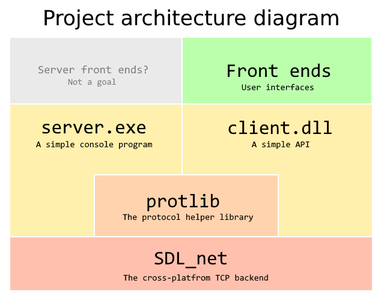
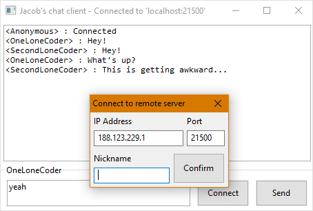

# Simple modular chat

This repository contains a full implementation of a chat server and a client using a 
[custom protocol](protlib/protocol.md) with a [custom format](format.md)

It was also an exercise for me to make a modular project - the client compiles into a 
shared library with a straightforward C API which can be used to make a variety of front ends.

Under the hood, it uses the cross-platform `SDL_net` library for TCP communication.

## The structure of this repository
The repository contains three directories (+the `frontends` directory), they can be thought 
of independent projects (although they can obviously use each other's header files)

* The `server`, which compiles into the server executable
* The `client`, which compiles into a shared library with a tiny C API
* The `frontends`, this folder can contain all the front-ends (GUIs, bots etc.)
  that use the client API
* The `protlib` is a tiny library that facilitates communication using the protocol,
  it is used by both the `client` and the `server`

Make sure to check out the READMEs in the individual modules.

## Implementing a front end
Implementing a front-end is as easy as cloning this repo, compiling the `client` with `make` 
(see the specifics in the `client/README`), creating a new folder in `frontends` and doing 
whatever you want (you'd probably also want to compile the server for testing).

## Licensing
For licensing info about the individual modules, check out their respective `LICENSE` files.  
The `server`, `client` and `protlib` directories, including all files in the root directory, 
are in the public domain. The individual front-ends can have any kind of an open source license.