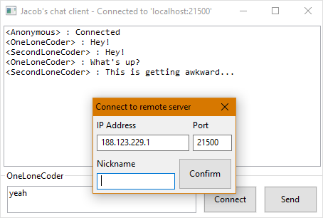

# The wxWidgets front end
This is the first front end that I developed, it is the first time
I seriously used C++ so it was kinda educational as well.
I am happy with how simple and straightforward the implementation
turned out to be (it's only ~400 lines of code!).

## Compiling
For compiling, you will obviously need the `client` shared library
compiled in it's directory and `wxWidgets`. 
Because there is a lot of ways to compile wxWidgets programs, 
you may want to just do it yourself, however, I included the 
`Makefile` that I used on Windows nonetheless, if you have 
downloaded the pre-built wxWidgets binary, you can just set the 
`WXW_PATH` environment variable to the path to the root folder and 
`make`. (wxWidgets labels the library directory according to the
compiler, for example `lib/gcc810_x64_dll`, so you might need to 
change this in the `Makefile` if you have a different version)